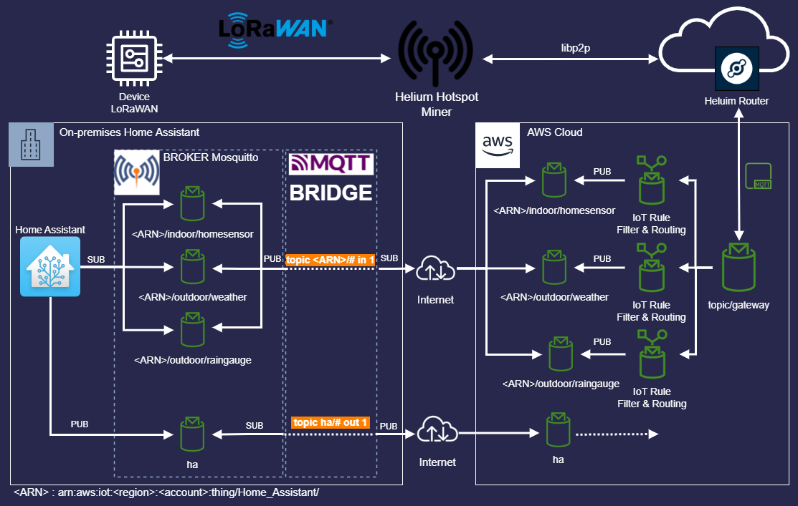
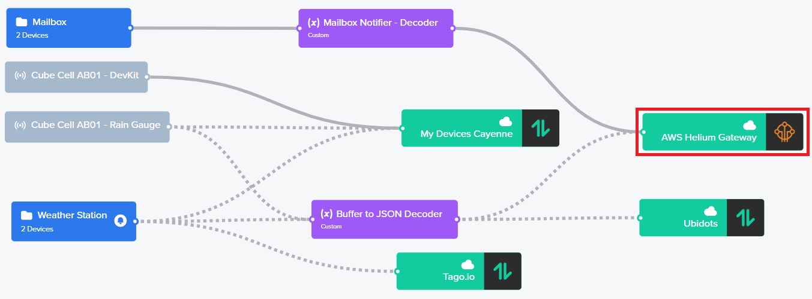
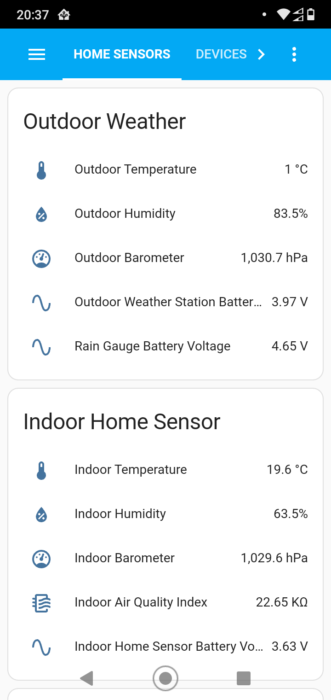

# Helium-Network-AWS-IoT-Core-Home-Assistant

This post explains how to retreive data from Helium Console to on-premises Home Assistant throught AWS IoT Core infrastrucutre. We will explain how to configure your local MQTT broker in bridge in order to replicate locally your data from AWS Iot Core.

## Table of Contents

 <!-- title: homeassistant -->

- [Helium-Network-AWS-IoT-Core-Home-Assistant](#helium-network-aws-iot-core-home-assistant)
  - [Table of Contents](#table-of-contents)
  - [Architecture Schema](#architecture-schema)
  - [Prerequisites](#prerequisites)
  - [Helium Console](#helium-console)
    - [Integration](#integration)
    - [Flow](#flow)
  - [AWS IoT Core](#aws-iot-core)
    - [Things Home Assistant](#things-home-assistant)
    - [Rules](#rules)
  - [Home Assistant](#home-assistant)
    - [Bridge MQTT](#bridge-mqtt)
    - [MQTT Sensor](#mqtt-sensor)
    - [Home Assistant Dashboard](#home-assistant-dashboard)
  - [Budget](#budget)
  - [References](#references)

## Architecture Schema


An MQTT Bridge can be considered as a local client that subscribes on a remote Topic and publishes the content on a local Topic. In contrast, the bridge can subscribe on a local Topic and publishes any content on a remote Topic.
A bridge can transfer bidirectionnaly data between two brokers or more. This pattern is particularly interesting when you want to transfer data between two infrastructures without opening your on-premises broker over Internet. Indeed, it is your local bridge nearby your local broker that establishes a remote connection with the remote broker hosted on the Cloud.

## Prerequisites

You have an instance Home Assistant running locally on a [raspberry pi](https://www.home-assistant.io/installation/raspberrypi) or [other](https://www.home-assistant.io/installation/).
Some official add-ons need to be installed before to going further :
-  Install "Terminal & SSH" :
   - In order to install this add-on, you need to enable "Advanced Mode" in your "profile" to see it
   - Under the "info" tab, set the settings below and start the add-on :
        - Start on boot  
-  Install "File editor" :
   -  Under the "configuration" tab, allow editing any file by not enforcing the basepath and save
   - Under the "info" tab, set the settings below and start the add-on :  
       - Start on boot
       - Show in sidebar      
-  Install "Mosquitto Broker" :
      -  To protect your broker, I advice you to create a new dedicated user :
         -  Menu "Settings"
         -  "People"
               -  "Add Person"
      -  Under the "configuration" tab edit the configuration file in YAML and fill it :
      ``` yaml
         logins:
           - username: mqtt_admin
             password: <password>
         require_certificate: false
         certfile: fullchain.pem
         keyfile: privkey.pem
         customize:
           # Enable external customization configuration
           active: true
           # The customization files will be saved under /share/mosquitto
           folder: mosquitto
         debug: true
      ```
      - Under "info", set the add-on to start on boot and start it now


> We will discuss later on how to configure the MQTT bridge under the folder */share/mosquitto*  

## Helium Console

### Integration

Before sending your messages to AWS IoT Core from Helium, you must configure the [integration](https://docs.helium.com/use-the-network/console/integrations/aws-iot-core/) between yours accounts.

> I retreived my messages from Helium to AWS IoT Core under the topic : ```topic/gateway```

### Flow

To forward devices's messages to AWS IoT Core, I route the flow just after an JSON decoder function to the AWS Integration. The devices's data are always decoded Helium side into JSON format and sended as is to AWS IoT Core. Here is a sample of what you can receive from Helium : [data-from-helium-to-aws-iot-core.json](./src/data-from-helium-to-aws-iot-core.json).

Right below, the basic flow used to forward messages to AWS IoT Core and other Integrations :



## AWS IoT Core

Go to the [AWS Management Console](https://aws.amazon.com/console/) and search the _IoT Core_ service and click on it.

### Things Home Assistant

First, you must create a specific thing for your Home Assistant under the menu _Manage/Things_. This thing will be your single endpoint to connect your _MQTT Bridge_ to your AWS account.

Step 1 :
  - Give a name to your thing : ```Home_Assistant```

Step 2 :
  - Let AWS auto-generate the certificate for your thing
> This asymmetric certificate will be used later by your MQTT bridge in order to establish an authenticated and encrypted connection between your MQTT Client and your AWS account

Step 3 :  
  - Create a _policy_ that will be attached to the certificate :
    -   Give a name for your _policy_ : ```BridgeMQTTPolicy```
    -   Copy/Paste the unbelow JSON content as Policy document and create :

``` json
{
  "Version": "2012-10-17",
  "Statement": [
    {
      "Effect": "Allow",
      "Action": "iot:*",
      "Resource": "*"
    }
  ]
}
```
> This policy is very important because it allows AWS to identify if your MQTT Client is authorized to interact with your AWS account through AWS MQTT Broker (Connect, Publish, Subscribe, Receive...)

Step 4 :
  - Download the Private Key and the Public Key and save them securely
  - Download the Amazon Root CA Certificate

That's it, you have now a thing with an ARN as follows : ```arn:aws:iot:<region>:<account>:thing/Home_Assistant```

### Rules

Now, you need to create some _Rules_ in order to retreive messages from Helium Topic  ```topic/gateway``` and republish them into a dedicated Topic that will allow to identify the device by Home Assistant.

Step 1 :
  - Go to the menu _Act/Rules_ and _Create_
  - Give a name : ```OutdoorWeatherStation```
  - Set the rule query statement :
  ``` SQL
  SELECT VALUE decoded.payload FROM 'topic/gateway' where dev_eui = '65432XRIKQ508035'
  ```
  > This query extracts the decoded payload content from the JSON retreived by the Helium gateway '```topic/gateway```' for my weather station registred in the Helium blockchain by the dev_eui '```65432XRIKQ508035```'

Step 2 :
   - Set "Add Action"
   - Choose "```Republish a message to an AWS IoT Topic```"
     - Click "```Configure Action```"
       - Set the Topic : ```arn:aws:iot:<region>:<account>:thing/Home_Assistant/outdoor/weather```
       - QoS : ```0```
       - Click "```Create Role```"
         - Give a name : ```IoTHomeAssistant```
         - Click ```Add action```
       - Click ```Create rule```

> This role provides permissions to republish messages into the Topic ```/outdoor/weather``` of the resource ```arn:aws:iot:<region>:<account>:thing/Home_Assistant``` :
               
``` json
{
    "Version": "2012-10-17",
    "Statement": {
        "Effect": "Allow",
        "Action": "iot:Publish",
        "Resource": "arn:aws:iot:<region>:<account>:topic/arn:aws:iot:<region>:<account>:thing/Home_Assistant/outdoor/weather"
    }
}
````
💡 Now, all messages from my weather station will be sent to the topic ```/oudoor/weather``` of my thing ```thing/Home_Assistant```

## Home Assistant

In this section, we are going to describe how to configure your MQTT Bridge and how to configure Home Assisant in order to inject JSON data from your remote devices into Home Assistant sensors.

### Bridge MQTT

Now, you are going to configure the bridge in order to retrieve messages from the thing ```Home_Assistant``` hosted by AWS IoT Core.


Step 1 :
  - Go to ```File editor``` from Home Assistant :
  - Create a new file ```bridge-mqtt-aws-iot-core.conf``` under the repository ```share/mosquitto```
  - Copy/Paste the template below and adapt the properties according to your needs :


``` properties
# ============================================================
# Bridge to AWS IOT
# ============================================================


connection aws-iot-core


# <Paste your AWS IoT Core ATS endpoint retrieved from the AWS CLI in the form of xxxxxxxxxxxxxxx-ats.iot.<region>.amazonaws.com:8883
address xxxxxxxxxxxxxxx-ats.iot.<region>.amazonaws.com:8883


# Specifying which topics are bridged and in what fashion
topic arn:aws:iot:<region>:<account>:thing/Home_Assistant/# in 1
topic ha/# out 1


# Setting protocol version explicitly
bridge_protocol_version mqttv311
bridge_insecure false


# Bridge connection name and MQTT client Id, enabling the connection automatically when the broker starts.
cleansession true
clientid homeassistant-mosquitto
start_type automatic
notifications false
log_type all


# ============================================================
# Certificate based SSL/TLS support
# ============================================================


#Path to the rootCA
bridge_cafile /ssl/mosquitto/aws_root_ca.pem


# Path to the PEM encoded client certificate
bridge_certfile /ssl/mosquitto/aws_iotcore_home_assistant.crt


# Path to the PEM encoded client private key
bridge_keyfile /ssl/mosquitto/aws_iotcore_home_assistant.key


#END of bridge.conf
```

The device data endpoint address refers to the URL that uniquely identifies the location of your AWS MQTT Broker :

``` properties
address xxxxxxxxxxxxxx-ats.iot.<region>.amazonaws.com:8883
```
> You can retrieve this property in the **Settings** of the IoT Core console.

Below, the property about the remote topic subscribed by the bridge :

``` properties
topic arn:aws:iot:<region>:<account>:thing/Home_Assistant/# in 1
```
> Thanks to the joker ```#``` the broker retreive all messages from the remote thing ```arn:aws:iot:<region>:<account>:thing/Home_Assistant``` and publishes them into the same local topic.

Below, the property about the local topic subscribe by the bridge :


``` properties
topic ha/# out 1
```
> In order to send messages to AWS IoT Core all messages publishes into the local topic ```ha``` will be sent to AWS IoT Core in the same remote topic. This can be useful, if you want to send metrics to some AWS Services for other purposes.


Below, the property for the Root Certificat Authority (Root CA) :


``` properties
bridge_cafile /ssl/mosquitto/aws_root_ca.pem
```
 > You will have to concatenate the two files (Root CA) into the same file and save it under the path of your choice or in the same path of mine ```/ssl/mosquitto/```      


Finally, properties about the Private Key and the Public Key of your AWS thing :


``` properties
bridge_certfile /ssl/mosquitto/aws_iotcore_home_assistant.crt
bridge_keyfile /ssl/mosquitto/aws_iotcore_home_assistant.key
```
> Save the Private Key and the Public Key of your AWS thing under the path ```/ssl/mosquitto/```.


  - When all your settings seem well, save the file ```bridge-mqtt-aws-iot-core.conf```
  - Restart your Mosquitto MQTT Broker
  - Check into the Logs that your customized configuration file ```share/mosquittobridge-mqtt-aws-iot-core.conf``` is well loaded :
```
[20:52:23] INFO: Starting NGINX for authentication handling...
[20:52:23] INFO: Starting mosquitto MQTT broker...
1668801144: Loading config file /share/mosquitto/bridge-mqtt-aws-iot-core.conf
```
Step 2 :
  - Test your bridge MQTT
  - Open the Web UI of your "Terminal & SSH" :
    - Enter the command : ```mosquitto_sub -h <Broker IP> -u mqtt_admin -P <password> -t "arn:aws:iot:<region>:<account>:thing/Home_Assistant/#"```
  - Go to the AWS IoT Core console and go to the ```MQTT test client``` and ```publish to a topic``` and enter your thing topic like ```"arn:aws:iot:<region>:<account>:thing/Home_Assistant/helloworld``` and click ```Publish to Topic```
  - Come back to your "Terminal & SSH" and check that you have received a message from your remote thing :


``` json
{
  "message": "Hello from AWS IoT console"
}
```
Step 3 :
  - Send data to AWS ioT Core
  - From the AWS IoT Core ```MQTT test client``` subscribe to the topic ```ha/helloworld```
  - Open the Web UI "Terminal & SSH" :
    - Enter the command : ``` mosquitto_pub -h <Broker IP> -u mqtt_admin -P <password> -t ha/helloworld on -m "Hello from Home Assistant"```
  - Come back to the AWS ```MQTT test client``` and "well done" your have received a message from Home Assistant !

💡 If you want to send data from Home Assistant to AWS IoT Core, you should use the [mqtt_statestream](https://www.home-assistant.io/integrations/mqtt_statestream/) integration. This integration allows to publish any entity changes into a specific ```base_topic```.

Below, the configuration in order to send entity changes into the local Topic ```ha``` :

``` yaml
mqtt_statestream:
  base_topic: ha
  include:
    entity_globs:
      - sensor.*temperature*
  publish_attributes: true
  publish_timestamps: true
```

### MQTT Sensor


In order to ingest MQTT message by Home Assistant, you will have to enrich the configuration.yaml file. For each sensor, you will have to define the local topic suscribed by Home Assistant and the JSON path value that identifies your sensor.


Below, an extract of my MQTT Sensor configuration :
``` yaml
mqtt:
  sensor:
    - name: "Outdoor Temperature"
      state_topic: "arn:aws:iot:<region>:<account>:thing/Home_Assistant/outdoor/weather"
      value_template: "{{ value_json.temperature.value }}"
      force_update: true
      device_class: "temperature"
      unit_of_measurement: "°C"
      unique_id: "weather.outdoor_temperature"
    - name: "Outdoor Humidity"
      state_topic: "arn:aws:iot:<region>:<account>:thing/Home_Assistant/outdoor/weather"
      value_template: "{{ value_json.humidity.value }}"
      force_update: true
      device_class: "humidity"
      unit_of_measurement: "%"
      unique_id: "weather.outdoor_humidity"
    - name: "Rain Gauge Battery Voltage"
      state_topic: "arn:aws:iot:<region>:<account>:thing/Home_Assistant/outdoor/raingauge"
      value_template: "{{ value_json.battery.value }}"
      force_update: true
      device_class: "voltage"
      unit_of_measurement: "V"
      unique_id: "weather.rain_gauge_battery_voltage"
    - name: "Rain Gauge Rainfall"
      state_topic: "arn:aws:iot:<region>:<account>:thing/Home_Assistant/outdoor/raingauge"
      value_template: "{{ value_json.rainfall.value }}"
      force_update: true
      device_class: "distance"
      unit_of_measurement: "mm"
      unique_id: "weather.rain_gauge_rainfall"      
```
> the attribute ```force_update: true``` is useful if you want to force the update of the value even if the value is the same as the last message received. It allows to have meaningful value graphs in history.

### Home Assistant Dashboard

Now, that I have synchronised my external data sensors with Home Assistant, I will be able to use them to control my house for future purposes.  



## Budget

🚀 This secure and affordable solution costs roughly $0.05 per months for three devices that send data every ten minutes.

## References

- AWS Official Blog : [How to Bridge Mosquitto MQTT Broker to AWS IoT](https://aws.amazon.com/blogs/iot/how-to-bridge-mosquitto-mqtt-broker-to-aws-iot/)

If you like my job don't hesitate to ⭐ my project !